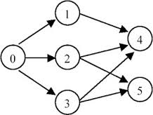

# Clone Graph

> Given an directed graph, a topological order of the graph nodes is defined as follow:
>
> For each directed edge `A -> B` in graph, A must before B in the order list.
>
> The first node in the order can be any node in the graph with no nodes direct to it.
>
> Find any topological order for the given graph.

> __Notice__: You can assume that there is at least one topological order in the graph.

## Example

For graph as follow:

## Sources

[LintCode](http://www.lintcode.com/en/problem/topological-sorting/)